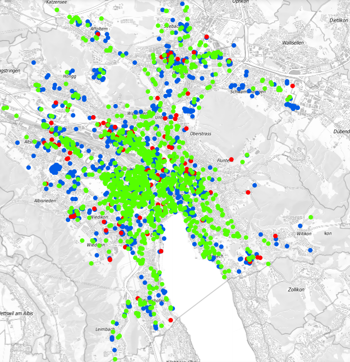

# Project of Data Visualization (COM-480)

| Student's name | SCIPER |
| - | - |
| Silas Meier | 367460 |
| Josua Stuck | 367491 |
| Damiano Amatruda | 353579 |

[Milestone 1](#milestone-1) • [Milestone 2](#milestone-2) • [Milestone 3](#milestone-3)

## Milestone 1 (7th April, 5pm)

### Dataset

In this project, we will visualize two datasets for the city of Zurich. The first dataset[^1] contains the locations and capacities of car parking spaces, while the second dataset[^2] contains the locations and capacities of bicycle and motorcycle parking spaces. The data in both datasets is in CSV format and does not need much preprocessing. Since the datasets are directly from the city of Zurich we expect their entries to be accurate.

[^1]: <https://opendata.swiss/en/dataset/offentlich-zugangliche-strassenparkplatze-ogd>

[^2]: <https://opendata.swiss/en/dataset/zweiradparkierung>

### Problematic

We will explore the data along the temporal axis. The goal is to visualize how public car parking spaces have been moved, removed or replaced by parking spaces for bicycles or motorcycles over time. We plan to analyze the historical data and focus on the effects of the recent change in parking space laws in the city of Zurich. This visualization is expected to be of interest to people living in the city and will potentially show the results of the end of the [_Parkplatzkompromiss_](https://www.stadt-zuerich.ch/ted/de/index/taz/publikationen_u_broschueren/der-historische-kompromiss-von-1996.html), a law aiming to keep the number of available car parking spaces in the inner city constant, no longer in effect since 2021.

### Exploratory Data Analysis

We observe that the dataset for car parking spaces contains approximately 50'000 entries representing individual parking spots, while the dataset for bicycle and motorcycle parking spaces contains around 2'000 entries representing grouped parking spaces.

#### Car parking spaces

For the car parking spaces, the data also includes information on the duration of the parking in minutes, the category of parking (e.g., blue or white zone), the location and whether the parking is paid or not.

Example:

| Max minutes | Category | Location | Paid |
| - | - | -| - |
| 360 | Blue zone | (x, y, z) | No |
| 60 | White zone | (x, y, z) | Yes |

#### Bicycle and motorcycle parking spaces

Example:

| Capacity | Vehicle | Location |
| - | - | - |
| 60 | Motorcycles | (x, y, z) |
| 50 | Bicycles | (x, y, z) |

### Related work

We did not find any previous work with the datasets in question.

The Zürich City website has visualizations of both datasets, but they are cluttered and don't show any historical data.

Our approach is original in analyzing the historical data, especially focusing on the effects of the recent change in parking space laws in the city of Zurich.

 

## Milestone 2 (7th May, 5pm)

**10% of the final grade**

## Milestone 3 (4th June, 5pm)

**80% of the final grade**

## Late policy

* < 24h: 80% of the grade for the milestone
* < 48h: 70% of the grade for the milestone
