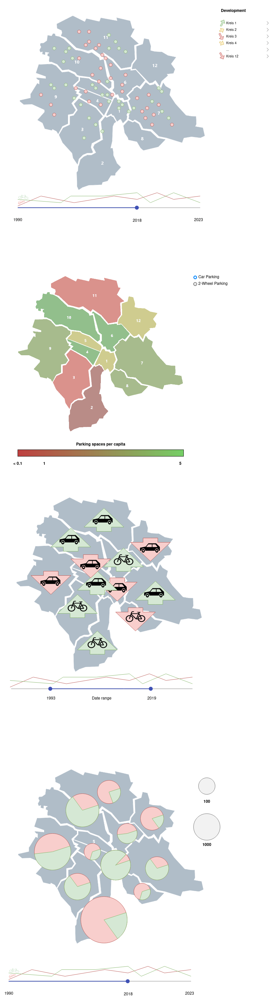

# Milestone 2

The goal of the project is to visualize the changes in parking spaces in the city of Zurich over time. We will focus on the effects of the recent change in parking space laws in the city of Zurich. Specifically we will also compare car parking spaces to 2-wheel parking spaces. We will use the data from the city of Zurich website and visualize it on a map of Zurich. We will try to also compare the data to some other data points, such as the population of the districts of Zurich. This data is available here [^3].

## Sketches of Visualizations

## Lectures and Tools

### Tools

We plan to use the **React** framework for the website and the **D3.js** library for the visualizations. We will also use the JavaScript programming language.
We will use data in the GeoJSON format for the maps, which can be used to create interactive maps with D3.js. Since we can query the data in the GeoJSON format from the city of Zurich website, we do not need to have a dedicated backend.

### Lectures

* Lecture: **Maps** and Lecture: **Practical Maps**
  For general map visualization and interaction.
* Lecture: **Perception colors**
  To have a good color scheme for the visualizations.
* Lecture: **D3.js**
  Interactive visualizations.
* Lecture: JavaScript

## Breakdown of goal into independent pieces. (Minimal viable product, and optional extensions)

1. Website "skeleton"
2. Map of Zurich
3. Show parking spaces on map
4. Show parking spaces over time

### Optional extensions

5. Show parking spaces per capita
6. Tooltips when hovering over districts or parking spaces.

[^3]: https://data.stadt-zuerich.ch/dataset/bev_bestand_jahr_quartier_od3240
