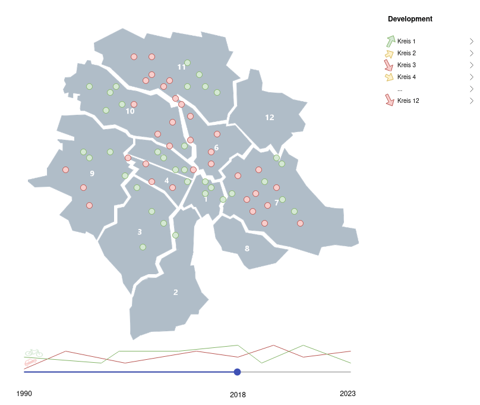
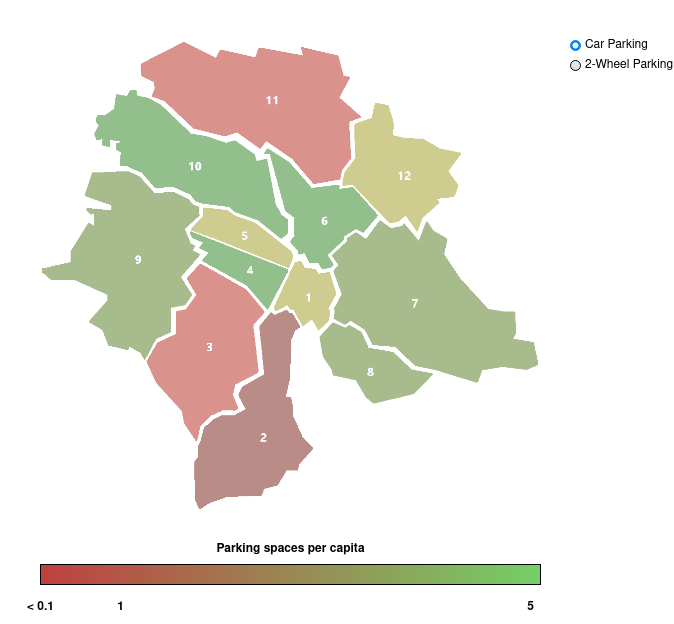
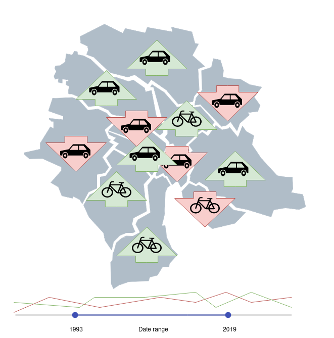
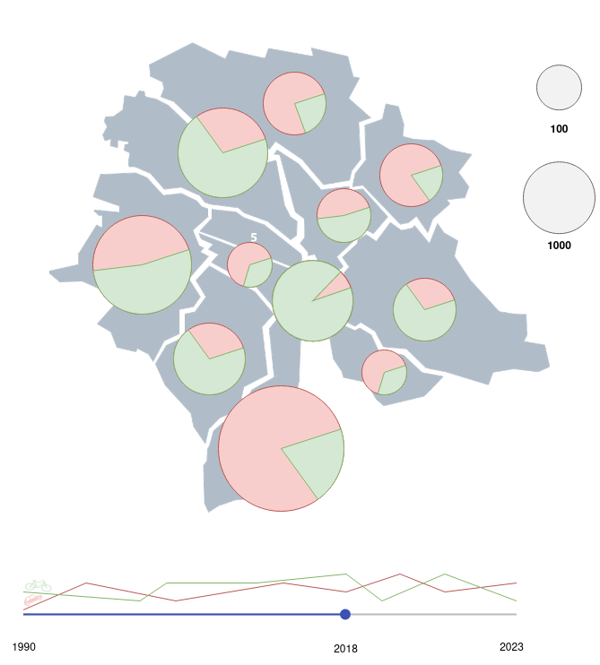
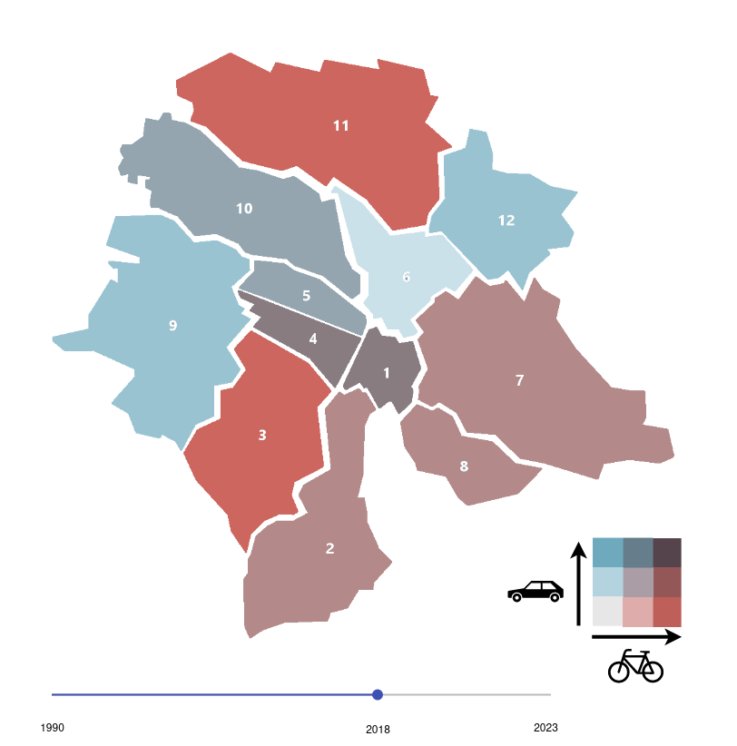
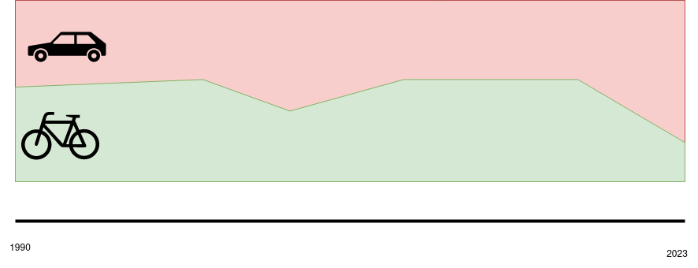
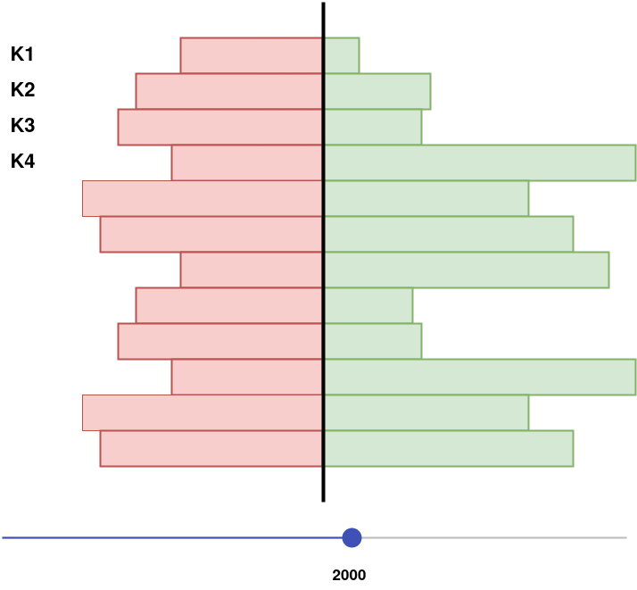
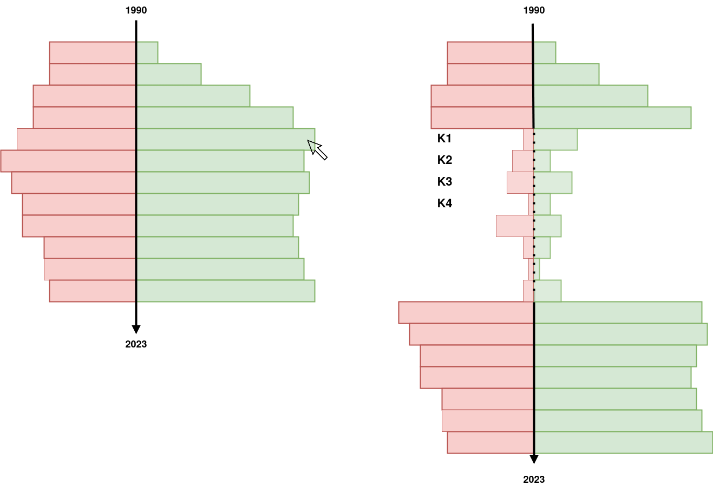

# Milestone 2

The goal of the project is to visualize the changes in parking spaces in the city of Zurich over time. We will focus on the effects of the recent change in parking space laws in the city of Zurich. Specifically we will also compare car parking spaces to 2-wheel parking spaces. We will use the data from the city of Zurich website and visualize it on a map of Zurich. We will try to also compare the data to some other data points, such as the population of the districts of Zurich[^1].

> The current state of the project is visible [here](https://project-2023-campiroboys.vercel.app).

[^1]: <https://data.stadt-zuerich.ch/dataset/bev_bestand_jahr_quartier_od3240>

## Sketches of Visualizations

Below are a few sketches of possible visualizations. We will probably use a combination of these visualizations.

#### Points

This is the approach that theoretically displays the most information. Each parking space is represented by a dot, where the color represents the type of parking space (car or 2-wheel). The user can possibly hover over a dot to get some more information. Below the map is a timeline, showing the change in parking spaces over time. The user can use the slider to select which point in time to display.

#### Combination with other variables

This visualization combines the number of parking spaces with a different variable, such as the population of the district. The user can select which variable to display. The user can also select which point in time to display.

#### Change over time

In this visualization, the user can select a range of time. The map will display the change in parking spaces over that time period.

#### Bivariate Pie diagram

In this visualization, the user can select a point in time. The map will display the number of parking spaces per district. The ration between the different types of parking spaces is displayed as a pie diagram. The size of the pie diagram represents the number of parking spaces in the district.

#### Bivariate 2-dimensional Color Palette

In this visualization, the color palette is two-dimensional, allowing to show both types of parking spaces at the same time with a single color. With this approach, the color palette needs to be chosen very carefully.

#### Simple Time Diagram

In this visualization, we show the whole timeline, and display the change in parking spaces over time.

#### Snapshot in Time per District (Kreis)

#### Change in Time overall, per District on Hover

This visualization shows the number of parking spaces over time (per year). When the user hovers over a specific year, the bars expand and split into bars for each district to give more information.

## Tools and Lectures

### Tools

We plan to implement the project using the programming language [TypeScript](https://www.typescriptlang.org), which adds static typing to [JavaScript](https://developer.mozilla.org/en-US/docs/Web/JavaScript). For the website we plan to use the framework [Next.JS](https://nextjs.org), which is based on [React](https://react.dev), and for the visualizations we plan to use the library [D3.js](https://d3js.org). We plan to deploy the website on the cloud service [Vercel](https://vercel.com). We will use data in the GeoJSON format for the maps, which can be used to create interactive maps with D3.js.

> It is possible to query the data in the GeoJSON format directly from the website of the city of Zurich.

> Currently, since the performance of the website is not optimal due to the large number of points on the map we display a subset of them. In the future we could use [Quadtrees](https://github.com/d3/d3-quadtree). We also currently only incorporate the newest data from 2023, the older datasets will be added in the future.

### Lectures

* **Maps** and **Practical Maps**: for the general map visualization and interaction.
* **Perception colors**: for the color scheme of the visualizations.
* **D3.js**: for the interactive visualizations.
* **JavaScript**: for the implementation.

## Breakdown of Goal into Independent Pieces

### Minimal viable product

1. Website skeleton
2. Map of Zurich
3. Map of parking spaces

### Optional extensions

4. Show parking spaces per capita
5. Tooltips when hovering over districts or parking spaces.
